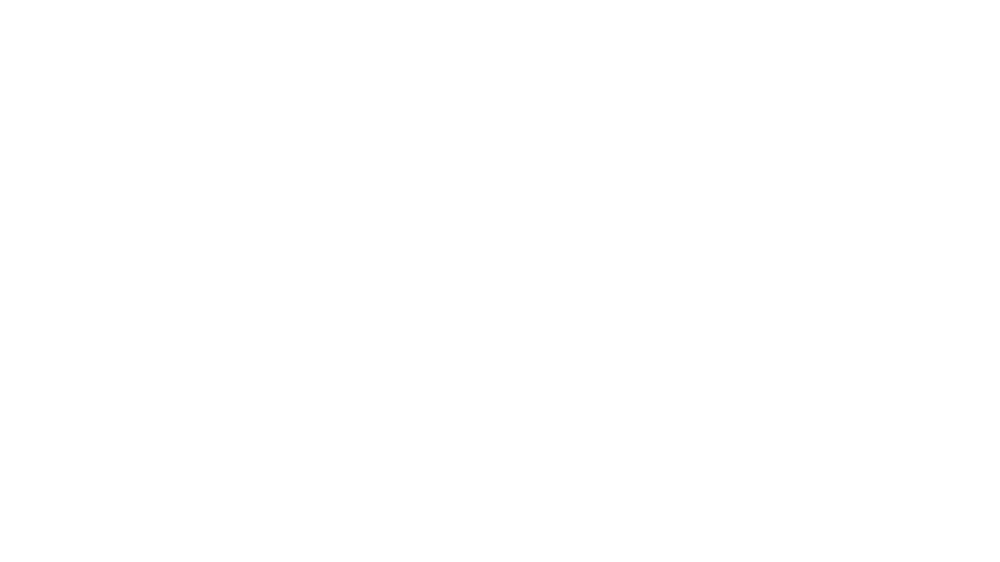

# AE_AudioSpectrum
AviUtlで音声波形を描画するスクリプトです。 
FFTを使用しているので、[After Effects](https://www.adobe.com/jp/products/aftereffects.html)の音声波形と同じ形状、動きの波形ができます。

## 要件
[Rikky Module](https://hazumurhythm.com/wev/amazon/?script=NRMv2q9Q&keyword=rikky_module&search_price=&sort=viewh&filter=all&page=1)を導入している必要があります。

## ファイル内容
  - **AE_AudioSpectrum.obj** 
	スクリプト本体です。

  - **README.md** 
	Markdown形式のREADMEです。

  - **README.txt** 
	Text形式のREADMEです。

  - **LICENSE** 
	このスクリプトのライセンスについて書かれています。

## 導入方法
  - 自分のAviUtlにrikky_moduleが導入されているかを確認します。
  - 同梱のREADMEを読んで、使い方、注意事項を確認します。
  - AE_AudioSpectrum.objをAviUtlのscriptフォルダにコピーします。
  - AviUtlを開いて、動作確認をします。

## 設定項目
  - **トラックバー** 
	- 開始位置 
	  波形の開始位置 (左端) の位置 (X) を指定します。

	- 終了位置 
	  波形の終了位置 (右端) の位置 (X) を指定します。

	- 周波数帯 
	  波形の線の量を指定します。

	- 高さ 
	  波形の高さを指定します。

  - **ダイアログ** 
	- 色 
	  波形の色を設定します。

	- 開始周波数 (0 ~ ) 
	  計算をする周波数帯の開始周波数を設定します。

	- 終了周波数 (0 ~ ) 
	  終了周波数を設定します。

	- サンプルレベル (0, 1, 2, 3) 
	  スペクトラムを計算する際のサンプルレベルを設定します。 
	  低い値を設定すると、時間軸は細かくなりますが、分割数は荒くなります。 
	  高い値を設定すると、分割数は細かくなりますが、時間軸は荒くなります。 

	- オーディオオフセット 
	  取得するスペクトラムのフレームオフセットを設定します。 
	  -1を設定すると、1フレーム前の波形を取得します。 
	  1を設定すると、1フレーム後の波形を取得します。 
	  同様に、-2だと2フレーム前、2だと2フレーム後を取得します。 

	- 太さ (0 ~ ) 
	  波形の太さを設定します。

	- ディスプレイオプション (0, 1, 2) 
	  描画する波形の種類を設定します。 
	  - 0 = 先端が丸い波形 
	  - 1 = 先端が平らな波形 
	  - 2 = 点のみの波形 

	- サイドオプション (0, 1, 2) 
	  波形を描画する方向を設定します。
	  - 0 = 上下両方向 
	  - 1 = 上方向のみ 
	  - 2 = 下方向のみ 

## ライセンス
MITライセンス 
詳しくは同梱のLICENSEをご覧ください。
